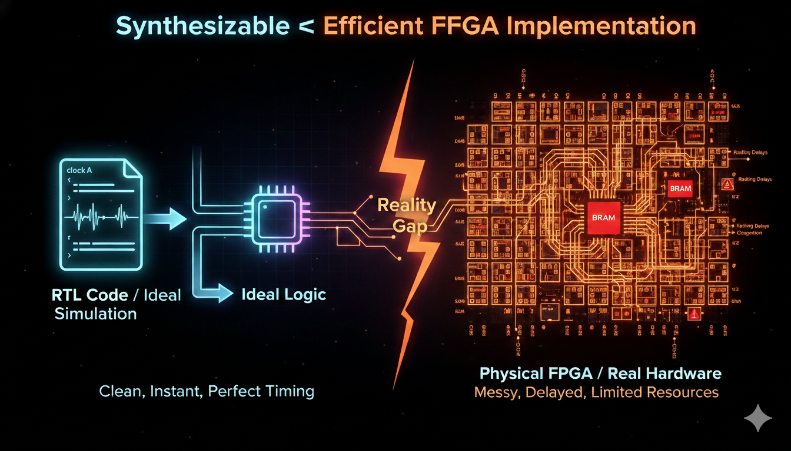
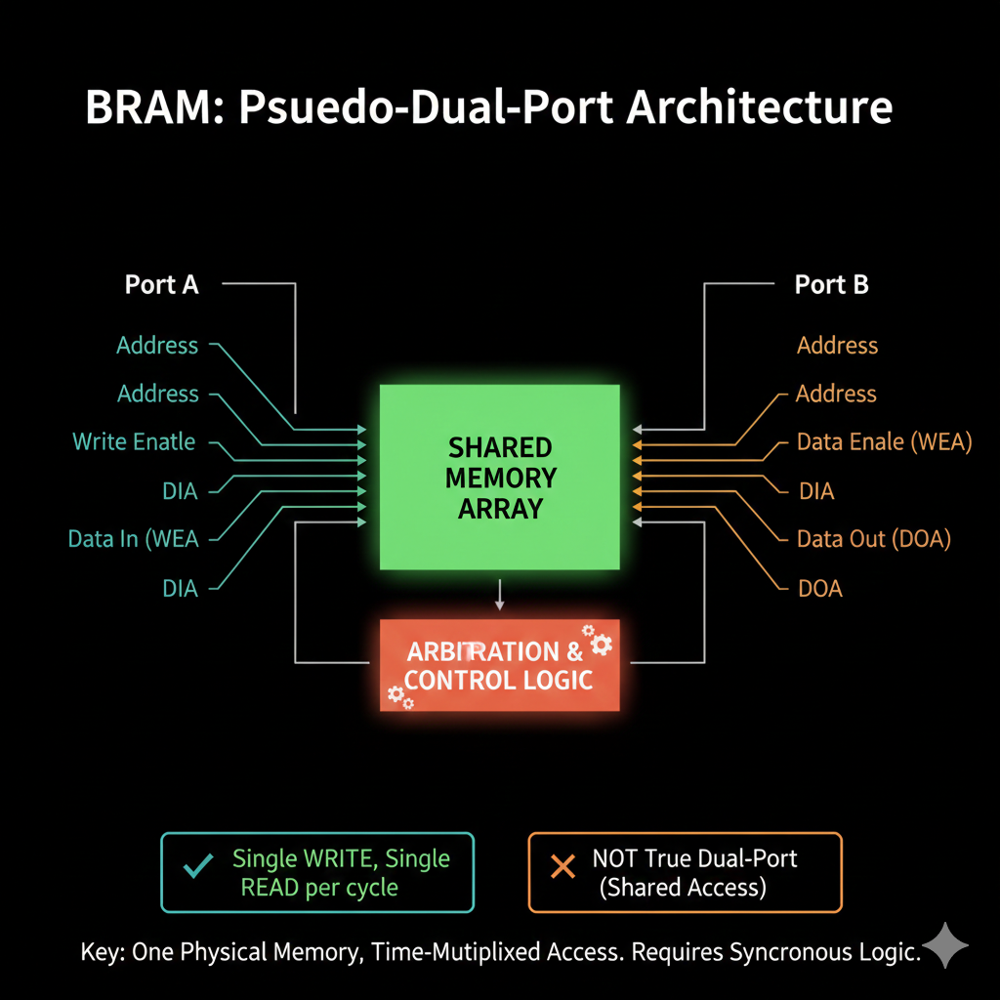

[//]: # (Synthesizable ≠ Efficient FPGA Implementation)

<p align="center">
  
</p>


Just like I discussed synthesis in the [previous blog](../synthesis/index.html), simply having a **synthesizable RTL does not mean that the design will work efficiently on an FPGA**.

To get an RTL design implemented on an FPGA, synthesis is a very important step. A lot of students or newcomers who use FPGAs for the first time assume that once the code synthesizes successfully, it is **_automatically efficient on hardware_**.

**That is not true**, and that is exactly what this blog is about.

## 1. Importance of the statement Synthesizable ≠ Efficient FPGA Implementation

No matter which FPGA you use, **synthesis will always be an essential step**. The reason is simple. If your code is not synthesizable, it cannot be broken down into basic hardware blocks such as **flip-flops**, **combinational logic**, and **memory elements**. If the hardware cannot be inferred, it cannot be mapped onto the FPGA fabric.

An FPGA is a **Field Programmable Gate Array** made up of configurable logic elements. These logic elements can only implement what the synthesis tool is able to infer from the RTL. _If the RTL is not synthesizable, the FPGA simply cannot be programmed with it._

However, **synthesis alone is not enough**. There are several other factors that decide whether the design will be efficient on FPGA hardware. Some of the important ones are:
- Proper use of SRAM that can map to **BRAM**
- Keeping **LUT usage** under control
- Using **correct signal widths**

These points become _critical_ as the design grows in size and complexity.

## 2. Resource Exhaustion

Before getting into more complex implementation issues, the easiest one to understand is **resource exhaustion**.

FPGAs are arrays of logic units called **LUTs** (Look-Up Tables) that can be programmed and reprogrammed. These LUTs are _limited in number_. Unlike ASICs, where the logic is custom built for a specific application, FPGA logic is general purpose. _This flexibility comes at the cost of limited resources._

ASICs can have far more optimized logic for a specific task, but they are also **very risky**. Any RTL bug that slips through verification and makes it to fabrication can render the entire chip _unusable_. That is why **FPGA prototyping** is such an important step before ASIC manufacturing.

When implementing designs on FPGA, you must **always** be aware of how many LUTs, flip-flops, and memory resources are being used. Poor RTL decisions can easily waste resources and prevent the design from fitting on the device.

## 3. SRAM and BRAM

### What is BRAM

**BRAM** stands for **Block RAM**. These are prebuilt memory blocks available inside the FPGA fabric. They are _far more efficient_ than implementing memory using LUTs.

At the hardware level, BRAMs are **not** implemented as fully independent multi-ported SRAMs like those used in high-end ASIC designs. Instead, BRAMs are implemented using **shared memory arrays** with internal sequencing and arbitration. In practical terms, this means BRAM behaves like what is commonly referred to as [**pseudo dual-port SRAM**](https://github.com/VLSI-Shubh/SRAM/tree/755f03a7ce4136a16cad363dd62f7bf808ef5ea1/Dual%20Port%20/Pseudo%20Dual%20port).

>Even though BRAM exposes two ports, the most commonly used configuration is **one write port and one read port**. These ports are _not physically independent_ in silicon. They share the same underlying memory array and operate under strict timing rules.

[**True dual-port SRAM**](https://github.com/VLSI-Shubh/SRAM/tree/755f03a7ce4136a16cad363dd62f7bf808ef5ea1/Dual%20Port%20/True%20Dual%20Port), where both ports can independently read and write at the same time using fully independent circuitry, is _very expensive_ in terms of **area and power**. That is why FPGA BRAM does not use that approach internally.

<p align="left">
  
</p>

If the RTL requires behavior that BRAM cannot support, the synthesis tool **falls back** to implementing memory using LUTs. LUT-based memory is essentially a large network of multiplexers, which works functionally but is _inefficient_ in terms of area and routing.

### Synchronous vs Asynchronous Read

BRAM supports **only synchronous read**. That means data is returned on a **clock edge**, _not immediately_ when the address changes.

Example of **synchronous read**, which **can** infer BRAM:

```verilog
always @(posedge clk) begin
    if (we)
        mem[addr] <= data_in;
    data_out <= mem[addr];
end
```

Example of **asynchronous read**, which **cannot** be mapped to BRAM:

```verilog
assign data_out = mem[addr];
```

Asynchronous read _forces_ the tool to use LUTs instead of BRAM because BRAM physically **cannot support** combinational address-to-data paths.

### Reset Behavior and BRAM

Another common issue is **reset behavior**. BRAM **cannot** reset every memory location using a reset signal. If the RTL tries to reset the contents of memory, the tool _cannot map it to BRAM_ and will instead use registers or LUTs.

**Correct approach**: Reset **control logic and pointers**, _not memory contents_.

Example of safe reset logic:

```verilog
always @(posedge clk) begin
    if (!rst_n) begin
        rd_ptr <= 0;
        wr_ptr <= 0;
    end
end
```

**Important**: Never try to reset the actual memory array like this:

```verilog
// ❌ BAD - This will NOT map to BRAM
always @(posedge clk) begin
    if (!rst_n) begin
        for (int i = 0; i < MEM_DEPTH; i++)
            mem[i] <= 0;  // Trying to reset all memory
    end
end
```

## 4. Why Synthesizable RTL Still Fails to Be Efficient

RTL can be **fully synthesizable** and still map _very poorly_ to FPGA hardware if it assumes **ASIC-style memory behavior**. This includes assumptions like:
- **Asynchronous read**
- **Arbitrary reset of memory**
- **Fully independent memory ports**

When these assumptions are violated, the synthesis tool has **no choice** but to use LUTs and registers instead of BRAM. This results in:
- _Higher resource usage_
- _Worse timing_
- _Inefficient designs_

## 5. Not Using a Proper SDF File

Another **critically overlooked** issue is **timing verification**. Without proper post-synthesis or post-place-and-route timing analysis using an **SDF (Standard Delay Format)** file, designs that work in simulation may _fail on real hardware_.

### What is an SDF File?

An **SDF file** is a standardized file format that contains **detailed timing information** about your design after it has been mapped to actual FPGA resources. It includes:
- **Propagation delays** through LUTs and other logic elements
- **Interconnect delays** between components
- **Setup and hold times** for flip-flops
- **Clock-to-output delays**

### Why SDF Matters for FPGA

At the RTL simulation level, timing is **idealized**. Your testbench assumes:
- Zero delay through combinational logic
- Instantaneous signal propagation
- Perfect setup/hold timing

In reality, **FPGA timing behavior depends heavily on**:
- _Routing delays_ - How far signals need to travel on the FPGA fabric
- _Placement_ - Where logic elements are physically located
- _Fanout_ - How many destinations a signal drives
- _Logic depth_ - Number of LUTs a signal passes through

_These delays are invisible at the RTL simulation level._

<p align="left">
  
</p>

### The Problem: Simulation vs Reality

Consider this common scenario:

```verilog
// RTL that works fine in simulation
always @(posedge clk) begin
    temp <= a & b;
    result <= temp | c;
end
```

In **RTL simulation**:
- Both statements execute with zero delay
- Timing appears perfect

On **actual FPGA hardware**:
- AND operation has propagation delay through LUT
- Routing delay from temp to OR gate
- OR operation has its own LUT delay
- If total delay exceeds clock period, **timing violation occurs**


### Common Timing Issues Caught by SDF

1. **Setup Time Violations**: Data changes too close to clock edge
2. **Hold Time Violations**: Data changes too soon after clock edge  
3. **Clock-to-Output Delays**: Output signal arrives late for next stage
4. **Cross-Clock Domain Issues**: Signals crossing between clock domains without proper synchronization

### Best Practices

✓ **Always** run gate-level simulation with SDF for critical paths  
✓ **Check** timing reports from place-and-route tools  
✓ **Add** timing constraints to guide the tool  
✓ **Use** proper clock domain crossing techniques  

✗ **Never** rely solely on RTL simulation for timing validation  
✗ **Don't** ignore timing warnings from synthesis tools  
✗ **Avoid** tight timing paths without margin  


### The Bottom Line

**SDF-based timing simulation is the bridge between RTL and hardware reality.** Without it, you're flying blind your design might synthesize perfectly, use resources efficiently, and still _fail catastrophically on actual hardware_ due to timing issues you never detected in simulation.

## Closing Thoughts

I have implemented several of my designs on the **TinyFPGA BX board**, and I can confidently say that **FPGA bring-up is a valuable skill**. Understanding how RTL maps to actual hardware makes a _massive difference_ in design quality.

The key takeaways from this blog are:
- **Synthesizable ≠ Efficient** - Always verify resource usage
- **BRAM inference requires specific coding patterns** - Synchronous reads, no arbitrary resets
- **Timing verification is critical** - Use SDF files for realistic simulation
- **Resource awareness matters** - Monitor LUTs, FFs, and memory utilization

If you are working with the TinyFPGA BX and want an up-to-date reference, I have created a [handbook](TinyFPGA-BX-Handbook.md) for it since most online resources are outdated.

Thank you, and I hope to see you in the next one!


