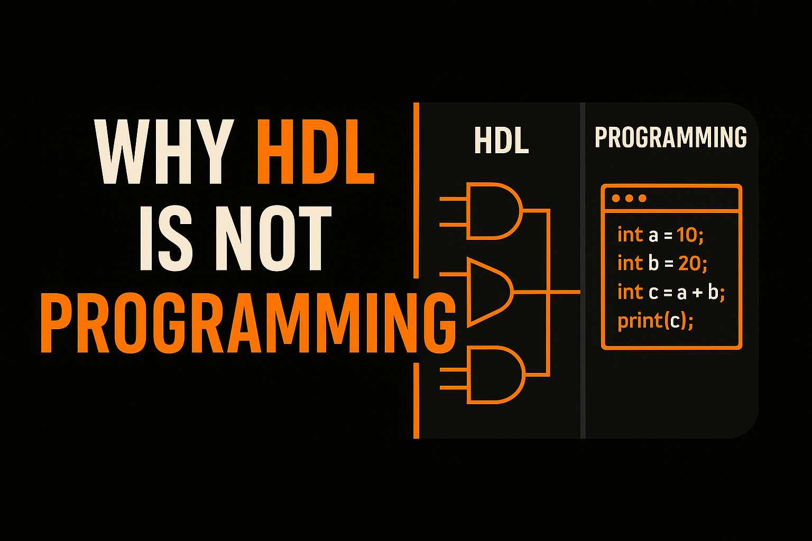

<p align="center">
  
</p>


This blog is about *demystifying* a very common misunderstanding that a lot of students have when entering the field of **VLSI**, especially when they come across **HDLs (Hardware Description Languages)**.

And it's not entirely their fault. Across the world, whenever someone hears the word *"language"*, especially in a tech context, people tend to associate it with programming languages, the most common being **Python**, **C**, or **C++** (not that other languages like **Rust** or **Java** are unpopular).  
[Wikipedia: C influences Python/Java syntax](https://en.wikipedia.org/wiki/C_(programming_language))

Because of that common usage of the word *language* in the context of programming, many assume that **HDLs** are also just another kind of programming language.

But that's not the case, and in this blog, I'll try to clarify why.

### 1. Syntax Similarity but Conceptual Difference

The biggest **commonality** between any programming language and an HDL is the *syntax*.  
When one starts learning HDL, especially **Verilog**, they often find it quite similar to **C**, and that's true to an extent. The syntax is indeed somewhat similar, but the **purpose** and **functionality** of these languages are fundamentally different.  
[GeeksforGeeks HDL vs Software comparison](https://www.geeksforgeeks.org/software-engineering/difference-between-hardware-description-language-and-software-language/)

A programming language needs existing hardware to compile and run on, whereas **HDL** is the language that *describes* or even *creates* that very hardware.  
[AllAboutCircuits HDL explainer](https://www.allaboutcircuits.com/technical-articles/what-is-a-hardware-description-language-hdl/)

### 2. Output: Programs vs. Circuits

In terms of output, programming languages can produce many kinds of results, from a simple `print("Hello World")` statement to complex data structures or algorithms.  
On the other hand, the output of an HDL is a **circuit**, or at least that is the ultimate goal.


### Verilog vs C: A Direct Comparison

<div style="display: grid; grid-template-columns: 1fr 1fr; gap: 2rem; margin: 2rem 0;">

<div style="background: var(--card); border: 1px solid var(--border); border-radius: 12px; padding: 1.5rem;">

**Verilog (Hardware Description)**
```verilog
module and_gate (
    input  wire a,
    input  wire b,
    output wire y
);
    assign y = a & b;
endmodule
```

*Describes a physical AND gate that exists continuously in hardware.*

</div>

<div style="background: var(--card); border: 1px solid var(--border); border-radius: 12px; padding: 1.5rem;">

**C (Programming Language)**
```c
#include <stdio.h>
int main(void) {
    int a = 1;
    int b = 0;
    int y = a & b;
    printf("%d\n", y);
    return 0;
}
```

*Executes instructions to compute a value at runtime.*

</div>

</div>

<style>
@media (max-width: 850px) {
  div[style*="grid-template-columns"] {
    grid-template-columns: 1fr !important;
  }
}
</style>

As you can see, Verilog describes hardware while C describes sequential instructions.


Not every HDL code can be directly turned into a circuit. That step is known as **synthesis**. If written carefully, the output of an HDL describes an actual circuit that breaks down into **gates**, **multiplexers**, **latches**, and **flip-flops**, which can, with proper tools, be further decomposed down to **transistors (PMOS and NMOS)** and beyond.  
[Cadence PCB HDL synthesis](https://resources.pcb.cadence.com/blog/2020-hardware-description-languages-vhdl-vs-verilog-and-their-functional-uses)

These circuits are what make up the chips used in everyday devices, from smartphones to cars and much more.

### 3. Language Levels: High and Low

One of the most significant differences between programming languages and HDLs lies in the concept of **language levels**.

Programming languages are categorized as *high-level* or *low-level* based on how easily the machine can break them down to execute the desired tasks.  
At the lowest level, we have **assembly language**, which directly corresponds to the instruction set architecture of a given machine, and **machine code**, which the hardware understands without any further translation.

Then comes **C**, one of the most popular and foundational languages of all.

[C ranks #2 on the TIOBE Index (9.29% share as of Oct 2025), powering firmware worldwide and available on virtually all architectures.](https://www.tiobe.com/tiobe-index/)

C is often regarded as the *mother of all programming languages* because it strikes a balance. It is high-level enough to be human-readable, yet close enough to hardware that the compiled code runs efficiently without requiring heavy translation.

That's why a lot of **firmware** and **embedded programming** is written in C. It sits at the borderline between high-level and low-level, allowing direct hardware interactions, something not easily possible with languages like Python or Java.  
[Low vs High-Level explanation video (2 min)](https://www.youtube.com/watch?v=bUWCD45qniA)

Python, Java, and other modern programming languages are much more human-readable, but it takes a lot more computational resources to compile and execute them efficiently.

*(Though personally, languages like Rust and Java aren't my favorites or something I'm interested in learning.)*

### 4. Why HDL Matters for Software Engineers

A major misconception among many software developers is that HDL isn't relevant to them. I strongly disagree.

Just as RTL engineers benefit from knowing programming languages, software engineers can benefit from understanding HDLs.  
With the recent trends in **AI** and the **shortage of RAM** in the market, efficiency is becoming increasingly important. Companies are optimizing their codebases to use less RAM and hardware resources, and a solid grasp of hardware description concepts can make a big difference.  
[SIGARCH HDL for AI accelerators](https://www.sigarch.org/hdl-to-adl/)

### 5. Execution: Parallel vs. Sequential

One of the most crucial differences between programming languages and HDLs is in their **execution model**.  
HDLs are **parallel** by nature, whereas programming languages are typically **sequential**.

What does this mean?

In HDL, all lines of code are effectively active at the same time. If there are 100 lines of code, line 1 and line 100 start executing simultaneously at time `t = 0`. The difference lies only in how and when their outputs are processed, depending on the circuit's behavior.

That's also why **clock signals** play such a critical role in HDLs. Timing governs how data moves through the hardware.

Programming languages, on the other hand, execute instructions sequentially. Line 1 runs before line 2, and so on.  
Although at a superficial level it might seem parallel due to features like multitasking, the underlying hardware still executes instructions one after another, sometimes leveraging concepts like **pipelining** or **out-of-order execution**, which again come from hardware design principles.  
[GeeksforGeeks parallel vs sequential table](https://www.geeksforgeeks.org/software-engineering/difference-between-hardware-description-language-and-software-language/)


### HDL vs. Programming: The Pasta Burner Example

Let's wrap this up with a simple analogy.

Think of HDL like cooking pasta using all four burners on a gas stove at once. One burner for the pasta, one for the sauce, one for the broth, and one for something else (I'm honestly not that great at cooking).

A programming language, on the other hand, is like cooking on a single burner. You have to boil the water first before adding the pasta. If you add the pasta before the water boils, you'll just end up burning it.

I hope I was able to explain the basics of the difference between pasta... ohh sorry,  **programming languages** and **HDLs**.

I'll be back soon with another topic like this. Hope to see you again.
