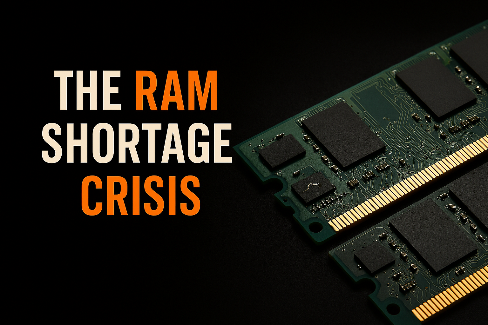
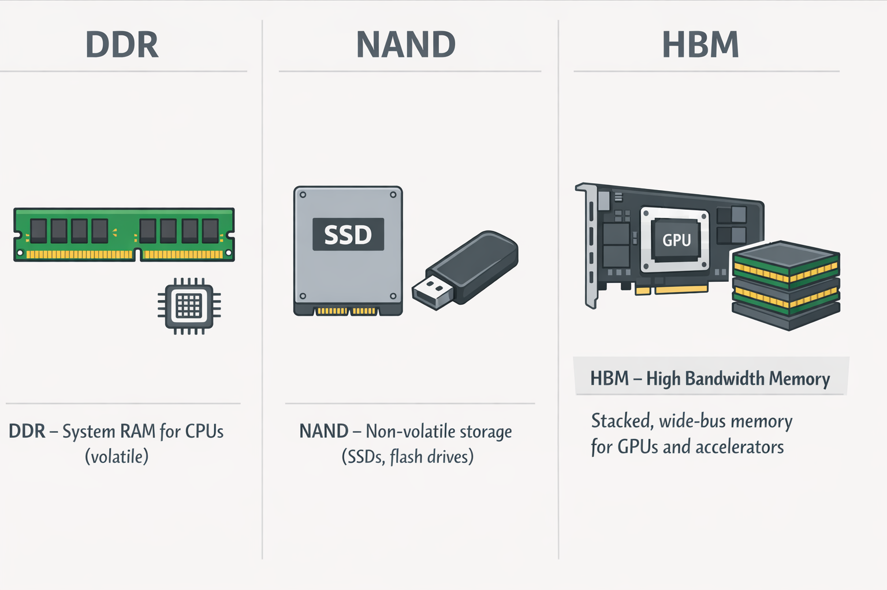
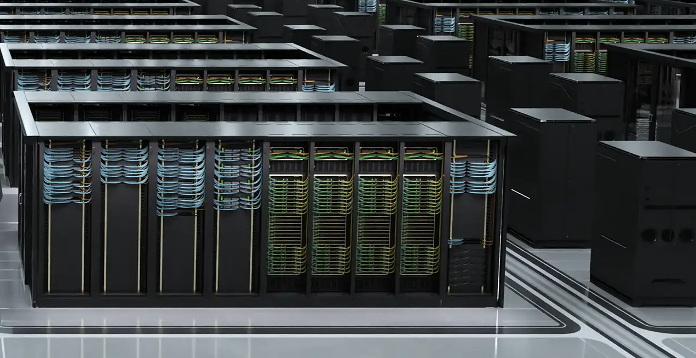

[//]: # (The RAM Shortage Crisis)

  

 

## What is this crisis or shortage

So AI has taken over not just your jobs but your RAM as well. Why do I say that. Let us dive a bit deeper.

Over the past year, conversations around hardware shortages have picked up again. This time, it is not GPUs alone. RAM is increasingly being pulled into the same discussion.

So what is actually happening in the world. Why is everyone talking about a RAM shortage. Is there really a crisis, or is this just temporary market noise.

To explain this properly, a few core ideas need to be laid out first.

 

## 1. Types of Memory

RAM, as most people know, is simply memory. But not all memory is the same.

At a high level, two families matter the most here:

- `DDR` memory  
  Used in CPUs, system RAM, and cache hierarchies. This is the memory most consumers interact with directly.

- `NAND` memory  
  A non volatile memory, meaning data is retained even when power is lost. This is why it is used in SSDs, flash drives, and storage devices.

Some of the biggest players in this space are Samsung, Micron (Crucial), and SK hynix.

Before getting into the shortage itself, there is another member of the memory family that needs attention. A distant cousin, but a very capable one, that has been making a lot of noise recently.

That memory is `HBM`, High Bandwidth Memory.

HBM is designed to deliver extremely high bandwidth while staying power efficient. This makes it critical for GPUs and accelerators that handle massive parallel workloads.

  

And once again, this leads us straight to AI.

 

## 2. The AI Advent

By now, most people have come across the term LLMs, or Large Language Models.

Everything you hear about today, whether it is GPT, Gemini, or other AI systems, is built on large models trained on enormous datasets.

These models are data hungry.

They need memory not just for training, but also for inference, caching, checkpoints, and intermediate outputs. Every iteration and improvement cycle increases memory demand.

This is where HBM becomes important.

HBM is fast, sits close to the GPU, and removes bandwidth bottlenecks that traditional DDR memory cannot handle efficiently. For AI training and inference, it is not just helpful, it is necessary.

 

## 3. The Real World Picture

With AI investments growing rapidly, real world money is following AI.

Every major technology company wants a share of this market, even if it means shifting resources away from traditional consumer products.

Not riding the AI wave today essentially means losing ground tomorrow. Because of this, profit focus has moved from consumer hardware to data centers and AI infrastructure.

HBM is heavily used in AI GPUs and large scale data centers. As a result, memory manufacturers are prioritizing HBM production over traditional DDR memory.

> According to TrendForce, HBM prices increased by roughly **20 to 30 percent** between late 2023 and early 2024 due to demand from AI accelerators.

During the same period:

- DDR4 and DDR5 prices increased by **10 to 15 percent**
- Production capacity was redirected from consumer memory toward HBM
- Supply for consumer systems tightened globally

Micron has publicly stated that a significant portion of its future DRAM investments will focus on HBM for AI customers. Consumer focused products, such as Crucial, operate on much thinner margins in comparison.

Samsung has also prioritized memory supply for servers and AI accelerators, reportedly limiting availability for mobile devices and consumer electronics.

At the same time, modern AI GPUs now ship with massive amounts of on package HBM. This reduces reliance on system RAM but increases overall memory cost.

Board partners such as ASUS and MSI still need to source DDR memory for consumer systems, often at higher prices, which eventually gets passed down to buyers.

  

 

## 4. Geopolitics

At the end of the day, all of this affects regular consumers the most.

Hardware becomes more expensive. Upgrade cycles slow down. Availability becomes unpredictable.

Memory manufacturing is also deeply tied to geopolitics. These companies contribute heavily to national economies, and access to advanced memory has become a strategic advantage.

Under the radar, export controls and delivery restrictions are being used to slow AI progress in certain regions.

In today’s environment, the country that leads in AI development is widely believed to have a long term technological and economic advantage.

Whether that belief proves fully true or not, it is clearly influencing industry decisions and government policy.

 

## So What Is Actually Happening

This is not a traditional shortage where factories cannot produce memory.

What we are seeing instead is a **supply shift**.

- New DDR memory prices increased by approximately **15 percent** in the last three months compared to the previous quarter
- Used RAM prices increased by around **10 percent** due to reduced availability of new stock
- HBM continues to receive priority allocation

Analysts from firms such as Gartner and TrendForce predict that AI driven memory demand will continue to grow for at least the next **8 to 10 years**, with HBM remaining the highest priority segment.

If you are planning to build a PC or upgrade a system, especially one that is memory heavy, the advice is simple.

Buy the memory early.

Waiting is far more likely to cost you more, not less.

 

## References

- TrendForce DRAM and HBM Market Reports  
  https://www.trendforce.com

- Micron Technology Investor Presentations  
  https://investors.micron.com

- Samsung Semiconductor Memory Roadmaps  
  https://semiconductor.samsung.com

- NVIDIA Data Center and AI Accelerator Documentation  
  https://www.nvidia.com/en-us/data-center

- Gartner AI Infrastructure Forecasts  
  https://www.gartner.com
