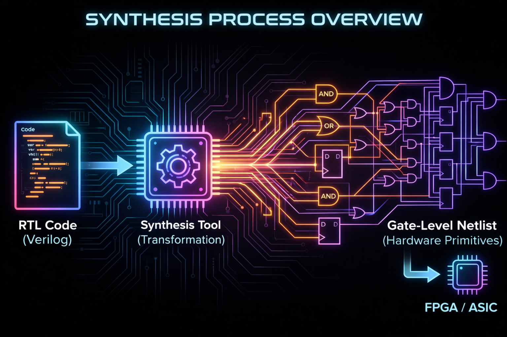
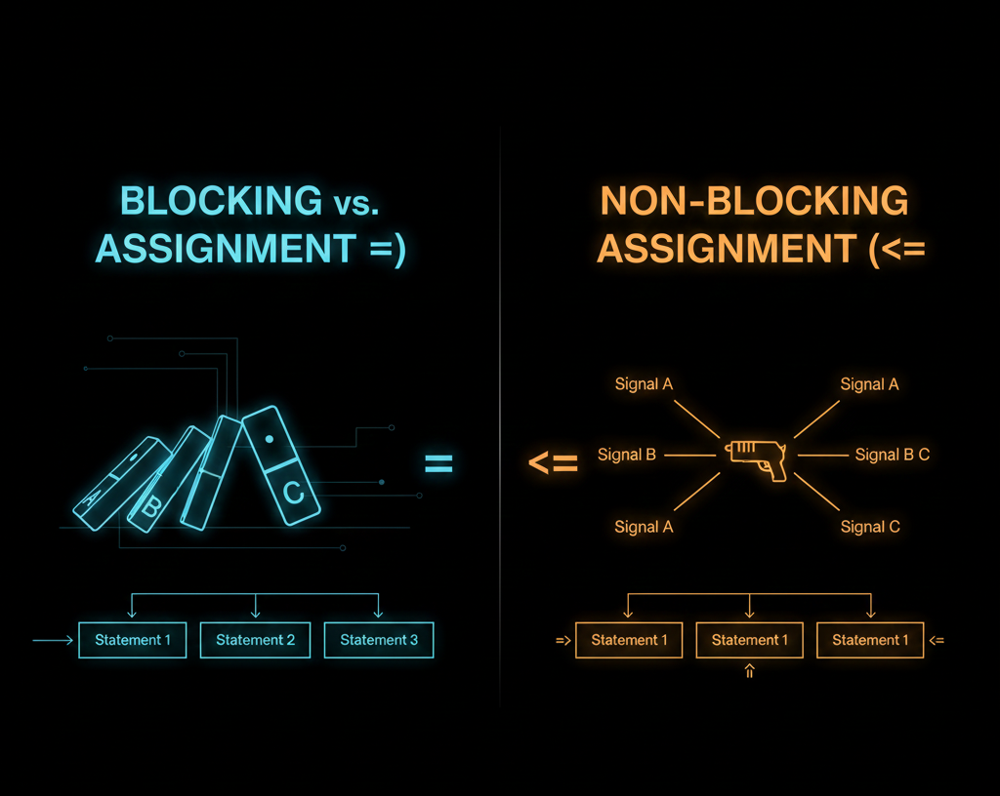
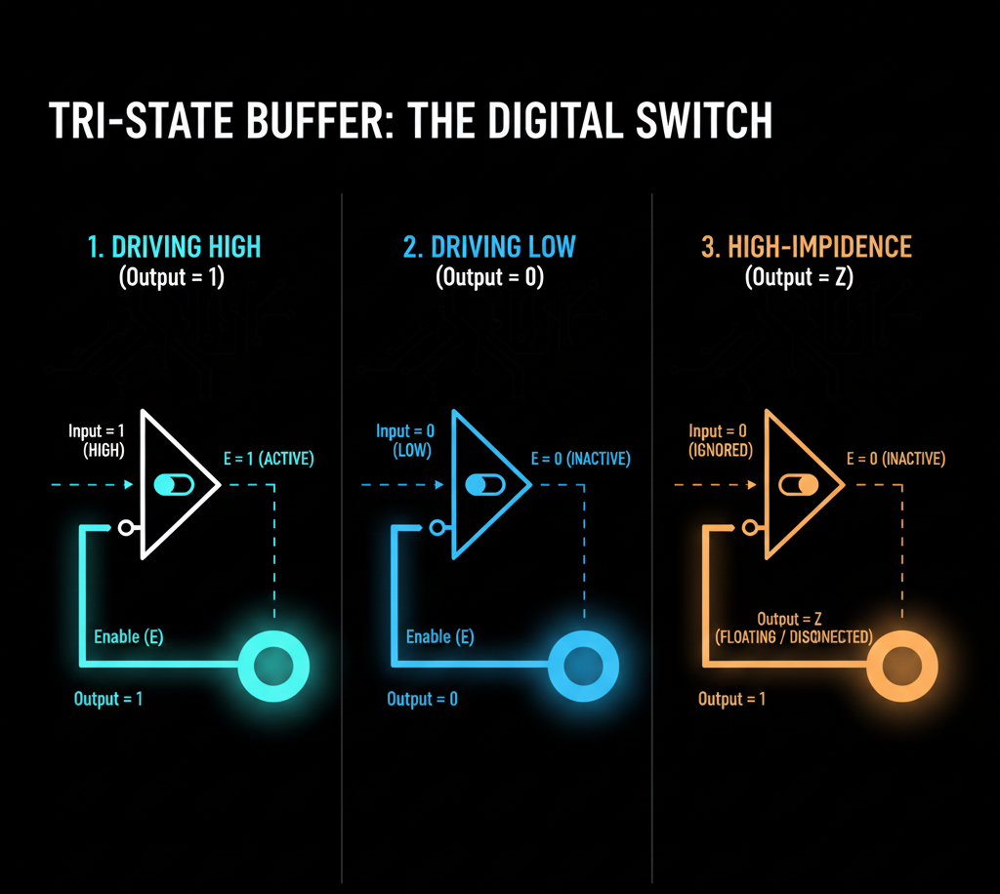

[//]: # (Understanding Synthesis: What Makes Verilog Code Synthesizable)


<p align="center">
  
</p>


While discussing ["Why HDL Is Not Programming"](../hdlVSprog/index.html), I briefly touched upon the concept of **Synthesis**.

In that blog, I only covered how properly written RTL code can be synthesized into different basic blocks, which can then be mapped onto either an **FPGA** or **ASIC Chip** depending on the target platform.

Today, I'll dive much deeper into what I actually mean by that. I'll introduce something called **constructs** and explain the various conditions that determine whether code is synthesizable or not.

Before moving forward, I want to clarify that the HDL language I'll primarily use to discuss this topic (and future topics) is **Verilog**. This is simply because it's widely used across the VLSI domain and is arguably the most popular HDL language, largely due to its syntax.

I also want to mention that this blog is going to be more elaborate and longer than the previous ones. The concepts here require more context and explanation since I can't assume everyone reading this knows all the terminology. However, I do assume you have some basic understanding of synthesis and Verilog. 

Also, in a future blog, I'll explain something really important that many people forget or ignore, especially those new to HDL implementation on FPGAs: **Synthesizable ≠ Efficient FPGA Implementation**.


## 1. What is Synthesis?

Synthesis is the process by which algorithmic descriptions of circuits are transformed into a design for electronic hardware[1]. In simpler terms, it means breaking down RTL code into smaller, fundamental building blocks like gates, multiplexers, flip-flops, etc.

When you provide RTL to synthesis tools, they essentially parse and break it down until it's converted into various basic hardware blocks. Below is a screenshot from the synthesis output of a [RISCV]() project I worked on. You can see it listing all the wires, muxes, gates, and other components it broke the entire circuit down into.

<p align="left">
  
</p>

<!-- {[//]:# ([RISCV Synthesis Output](https://github.com/VLSI-Shubh/RISCV-32I-Processor/blob/a8731c4e5fb70e7b1b3c3ed6feabbee3e9759859/PipelineExecution/synth/core_pip.svg))} -->


## 2. Constructs

The first question that comes to anyone's mind when learning about synthesis is: **How do I determine if code is synthesizable or not?** Or more specifically, **what makes code synthesizable, and what prevents it from being synthesizable?**

This is a fundamental question with many answers and interpretations. I'll try to clarify it as much as I can based on my knowledge.

There's a concept in Verilog called **Constructs**. These are essentially the fundamental syntax elements used to describe hardware behavior and structure at the Register Transfer Level (RTL). They enable synthesis tools to map designs to actual gates. Constructs are mainly categorized into four types:

### A. Synthesizable Constructs

Think of these as complete recipes that synthesis tools can directly convert into flip-flops, wires, and logic gates without any guesswork.

- **Simple wires and regs**: `wire a;` connects signals like physical wires, while `reg q;` creates storage elements like flip-flops when clocked.
- **Always blocks**: `always @(posedge clk)` for clocked logic (sequential circuits like registers), and `always @(*)` for combinational logic (immediate reactions like AND gates).
- **Common operators**: Operators like `+`, `==`, `if-else` map directly to adders, comparators, and multiplexers. The tools know exactly what hardware to create.

### B. Partially Synthesizable (Works, But Watch Out)

- **Incomplete if or case statements**: When you don't cover all possible cases, tools assume you forgot something and add **latches** (storage elements that hold values). This is great for some designs but can be accidental and problematic in others.
- **Loops like `for(i=0; i<4; i++)`**: These unroll into parallel hardware if the bounds are fixed at compile time. However, dynamic bounds might limit optimization.

_Result: You'll get functional circuits, but you need to carefully review synthesis reports to avoid surprise latches or bloated designs._

### C. Ignored Constructs

Synthesis tools parse these for completeness but treat them as "simulation-only notes." They generate no gates or latches.

- **Delays**: `#5` or `#10 clk` - tools simply ignore the delay, so `a = #5 b;` becomes just `a = b;`.
- **Drive strengths**: `wire (strong1, pull1) w;` - strengths like strong/pull are dropped since only connectivity matters in synthesis.
- **Timescale directives**: `` `timescale 1ns/1ps`` - purely for simulation timing precision, completely ignored during hardware mapping.
- **Specify blocks**: Timing specifications like `specparam` for path delays are used in timing simulation but bypassed in synthesis.

*Note: These are mostly used in testbenches for simulation purposes.*

### D. Non-Synthesizable

These constructs are made completely for simulation purposes only. Synthesis tools will either skip them or throw errors because there's no real hardware equivalent.

- **Delays like `#5`**: Pure simulation timing. Hardware doesn't "wait" like software does.
- **System tasks**: `$display`, `$monitor`, or `initial` blocks for printing messages or one-time setup. No gates can be inferred from these.
- **Advanced verification constructs**: Things like `fork-join`, file I/O operations, etc. These are great for verifying behavior in simulation but are ignored during synthesis.
- **While and Wait loops**: These are considered potentially infinite loops and cannot be synthesized.

> **Question**: You might be wondering why `for` loops are synthesizable (or partially synthesizable) but `while` loops are not synthesizable at all.

The answer lies in how these loops are implemented at the hardware level.


<div style="display: grid; grid-template-columns: 1fr 1fr; gap: 2rem; margin: 2rem 0;">
<div style="background: var(--card); border: 1px solid var(--border); border-radius: 12px; padding: 1.5rem;">

**For Loop (Synthesizable)**
```verilog
module counter_for (
    input  wire clk,
    output reg [7:0] sum
);
    integer i;
    always @(posedge clk) begin
        sum = 0;
        for (i = 0; i < 8; i = i + 1) begin
            sum = sum + i;
        end
    end
endmodule
```
*Loop bounds are known at compile time, so it unrolls into parallel hardware with fixed iterations.*

</div>
<div style="background: var(--card); border: 1px solid var(--border); border-radius: 12px; padding: 1.5rem;">

**While Loop (Non-Synthesizable)**
```verilog
module counter_while (
    input  wire clk,
    input  wire [7:0] limit,
    output reg [7:0] sum
);
    integer i;
    always @(posedge clk) begin
        sum = 0;
        i = 0;
        while (i < limit) begin
            sum = sum + i;
            i = i + 1;
        end
    end
endmodule
```
*Loop bounds depend on runtime input, so the synthesizer can't determine required hardware resources at synthesis time.*

</div>
</div>

**Why For Loops Synthesize But While Loops Don't:**

The key difference is that `for` loops have **compile-time deterministic bounds**. This allows the synthesizer to unroll them into a fixed amount of hardware. In contrast, `while` loops have **runtime-dependent conditions**, making it impossible to determine the hardware structure during synthesis.

More critically, if the condition of a `while` loop is never satisfied, it enters an **infinite loop**. In software, this simply hangs the program. But in hardware, you cannot create "infinite hardware". Physical circuits must have finite resources and defined behavior. The synthesizer has no way to build hardware that can handle unbounded or potentially infinite iterations. This is fundamentally why `while` loops with non-constant conditions cannot be synthesized.

## 3. Blocking vs Non-Blocking Assignments

One of the most critical concepts in Verilog synthesis is understanding the difference between **blocking (`=`)** and **non-blocking (`<=`)** assignments. These two assignment operators fundamentally change how your code is synthesized into hardware.

<p align="center">
  
</p>

### Blocking Assignment (`=`)

Blocking assignments execute **sequentially**, one after another, within the same simulation time step. They are primarily used for **combinational logic**.
```verilog
module blocking_example (
    input wire a,
    input wire b,
    output reg y
);
    always @(*) begin
        y = a & b;  // Blocking assignment
    end
endmodule
```

In this example, the assignment happens immediately, and any subsequent statements in the same block will see the updated value of `y`. This synthesizes to pure combinational logic (an AND gate).

### Non-Blocking Assignment (`<=`)

Non-blocking assignments schedule updates to occur at the **end** of the current simulation time step. All right-hand sides are evaluated first, then all left-hand sides are updated simultaneously. They are primarily used for **sequential logic** (registers/flip-flops).
```verilog
module nonblocking_example (
    input wire clk,
    input wire d,
    output reg q
);
    always @(posedge clk) begin
        q <= d;  // Non-blocking assignment
    end
endmodule
```

This synthesizes to a D flip-flop, where `q` captures the value of `d` on the rising edge of the clock.

### Why It Matters for Synthesis

**Golden Rule:**
- Use **blocking (`=`)** in `always @(*)` blocks for **combinational logic**
- Use **non-blocking (`<=`)** in `always @(posedge clk)` or `always @(negedge clk)` blocks for **sequential logic**

**What happens if you mix them incorrectly?**
```verilog
// INCORRECT - Blocking in sequential logic
always @(posedge clk) begin
    a = b;
    c = a;  // Uses the NEW value of 'a', not the old one!
end

// CORRECT - Non-blocking in sequential logic
always @(posedge clk) begin
    a <= b;
    c <= a;  // Uses the OLD value of 'a' from before the clock edge
end
```

In the incorrect example, `c` gets the value that `b` had, not the previous value of `a`. This creates entirely different hardware than you intended. Instead of two cascaded flip-flops, you might end up with one flip-flop followed by combinational logic.

**Synthesis Impact:**

| Assignment Type | Logic Type | Hardware Generated | Typical Use |
|-----------------|------------|-------------------|-------------|
| Blocking `=` | Combinational | Gates, Muxes | `always @(*)` |
| Non-Blocking `<=` | Sequential | Flip-flops, Registers | `always @(posedge clk)` |

Mixing these incorrectly can lead to:
- Simulation vs synthesis mismatches
- Race conditions
- Unintended hardware behavior
- Difficult-to-debug timing issues

## 4. Handling X and Z Values in Synthesis

In Verilog, there are four logic values: `0`, `1`, `x` (unknown/don't care), and `z` (high impedance). While all four are extremely useful in simulation, synthesis tools handle `x` and `z` very differently than you might expect.

### The Four-Value Logic System

- **`0`** - Logic low
- **`1`** - Logic high
- **`x`** - Unknown or don't care
- **`z`** - High impedance (tri-state)

### How Synthesis Treats `x` Values

During synthesis, **`x` is typically treated as a don't-care condition**. The synthesizer will optimize it as either `0` or `1`, depending on what produces the most efficient hardware.
```verilog
module x_example (
    input wire sel,
    input wire a,
    output reg y
);
    always @(*) begin
        if (sel)
            y = a;
        else
            y = 1'bx;  // Don't care
    end
endmodule
```

The synthesizer might optimize this to simply `y = a` when `sel` is `1`, and potentially leave `y` in any state when `sel` is `0` (or optimize it to `0` or `1` for simplicity). The `x` essentially tells the tool "I don't care what happens here, optimize as you see fit."

**Important**: Using `x` in RTL doesn't create any special hardware. It's purely an optimization hint. In actual hardware, there is no "unknown" state - a signal is always either high or low.

### How Synthesis Treats `z` Values

The `z` (high impedance) value is more interesting because it **can** actually be synthesized, but only in very specific contexts, primarily for **tri-state buffers**.

#### Synthesizable Use of `z`:
```verilog
module tristate_buffer (
    input wire enable,
    input wire data_in,
    output wire data_out
);
    assign data_out = enable ? data_in : 1'bz;
endmodule
```

This creates a tri-state buffer. When `enable` is high, `data_out` drives `data_in`. When `enable` is low, `data_out` is in a high-impedance state (electrically disconnected), allowing other drivers to control the bus.

<p align="center">
  
</p>

>**Synthesized Hardware**: This directly maps to actual tri-state buffer primitives available in FPGAs and ASICs.

#### Non-Synthesizable Use of `z`:
```verilog
module invalid_z_usage (
    input wire clk,
    input wire rst,
    output reg [7:0] a
);
    always @(posedge clk) begin
        if (!rst)
            a <= 8'bz;  // PROBLEM!
        else
            a <= 8'b0;
    end
endmodule
```

**Why is this problematic?**

A register (flip-flop) **cannot** store a high-impedance state. Registers can only store binary values (`0` or `1`). The synthesizer will either:
- Give you an error
- Ignore the `z` assignment and treat it as a don't-care (similar to `x`)
- Generate unexpected hardware

**The fundamental rule**: You can only assign `z` to:
- **Continuous assignments (`assign`)** for tri-state buffers
- **Outputs** that are explicitly intended to be tri-stated
- **NOT to registers or internal signals**

### Practical Synthesis Guidelines for X and Z

**For `x` values:**
- Use `x` in simulation for initialization or don't-care conditions
- Remember that synthesis treats it as an optimization opportunity
- Never rely on `x` propagating through your design because it won't exist in real hardware

**For `z` values:**
- Only use `z` for tri-state outputs with `assign` statements
- Modern FPGA designs often avoid tri-state logic internally and use muxes instead
- Never assign `z` to registers or clocked logic
- Tri-state is mainly used for bidirectional I/O pins

### Example: Correct vs Incorrect Usage
```verilog
// CORRECT - Tri-state buffer on output
module correct_tristate (
    input wire oe,
    input wire data,
    output wire bus
);
    assign bus = oe ? data : 1'bz;
endmodule

// INCORRECT - Trying to store Z in a register
module incorrect_tristate (
    input wire clk,
    input wire oe,
    input wire data,
    output reg bus
);
    always @(posedge clk) begin
        bus <= oe ? data : 1'bz;  // Won't synthesize properly!
    end
endmodule

// CORRECT Alternative - Use combinational logic
module correct_alternative (
    input wire clk,
    input wire oe,
    input wire data,
    output wire bus
);
    reg data_reg;
    
    always @(posedge clk) begin
        data_reg <= data;  // Store in register
    end
    
    assign bus = oe ? data_reg : 1'bz;  // Tri-state at output
endmodule
```

**Key Takeaway**: In modern FPGA design, tri-state logic is increasingly rare for internal buses. Most designs use multiplexers for bus sharing and reserve tri-state only for external bidirectional I/O pins where it's electrically necessary.

---

Before concluding this blog, I'd like to strongly recommend that you always refer to the [**IEEE Standard Verilog Hardware Description Language**](https://www.siue.edu/~gengel/ece585WebStuff/OVI_VerilogA.pdf). Reading the official language reference manual will give you a much deeper understanding of synthesizable and non-synthesizable constructs and syntax.

I hope this blog helped you understand the fundamentals of synthesis. This was indeed a long one, but the topic demands extensive context and explanation. If you have any questions or feedback, feel free to reach out!

**Next up**: In the next blog, I'll be discussing why **synthesizable code doesn't automatically mean efficient FPGA implementation**, where we'll explore BRAM, DSP blocks, and resource optimization.